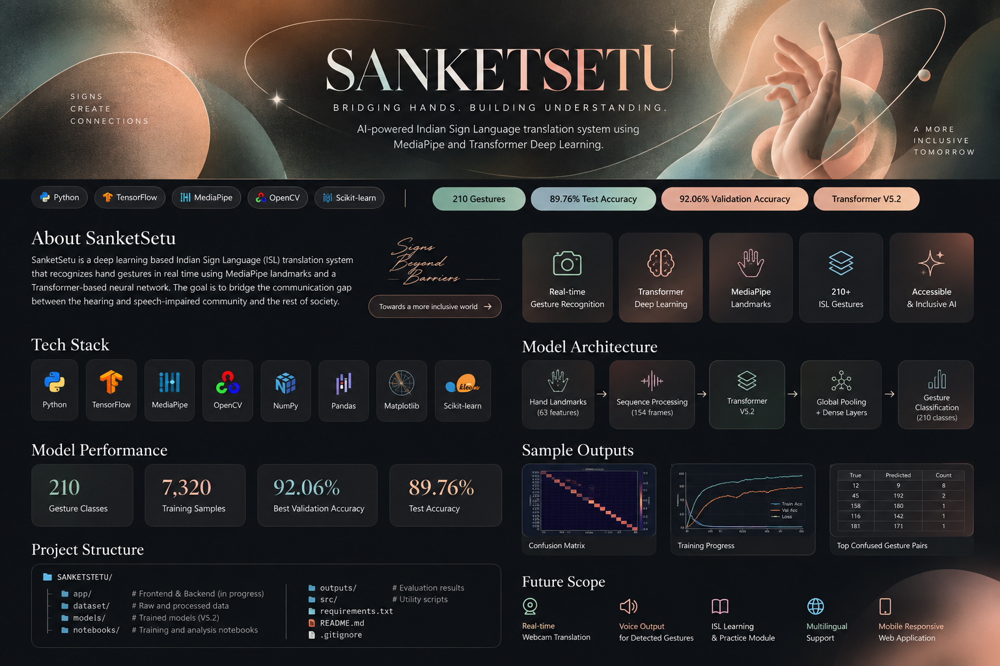
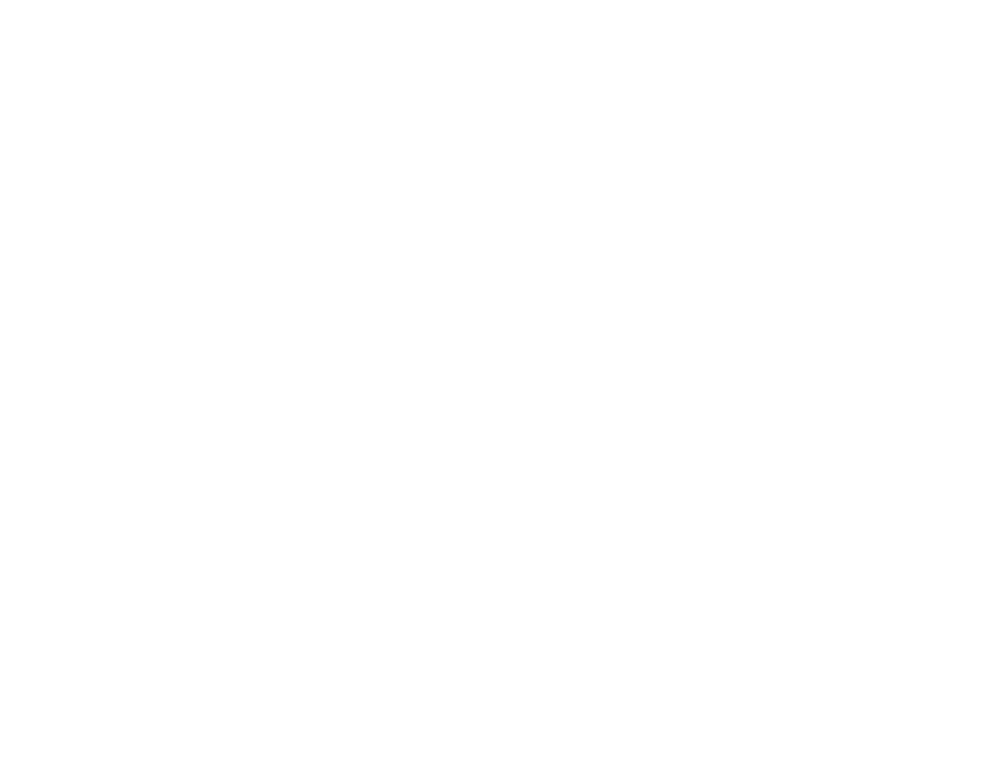

<p align="center">
  
</p>

<h1 align="center">🤟 SanketSetu</h1>

<p align="center">
  <b>Bridging Hands. Building Understanding.</b><br>
  AI-powered Indian Sign Language Translation using MediaPipe + Transformer Deep Learning.
</p>

<p align="center">

  

  

  

  

</p>

---

# 🤟 SanketSetu — AI Powered Indian Sign Language Translator

> Bridging Hands. Building Understanding.

SanketSetu is a deep learning based Indian Sign Language (ISL) translation system that recognizes hand gestures in real time using **MediaPipe landmarks** and a **Transformer-based neural network**. The goal is to bridge the communication gap between the hearing and speech-impaired community and the rest of society.

---

## ✨ Features

- 🤟 Real-time Indian Sign Language gesture recognition.
- 🧠 Transformer V5.2 deep learning model.
- 📷 MediaPipe hand landmark extraction.
- 🎯 210 ISL gesture classes.
- 📊 Model evaluation with confusion matrix and per-class accuracy.
- 🌙 Modern frontend with Dark & Light theme (in progress).

---

## 📸 Project Preview


### Confusion Matrix



---

## 📸 Project Screenshots

### Model Evaluation

#### Confusion Matrix


#### Classification Report


#### Top Confused Gesture Pairs


> More UI screenshots will be added after frontend integration.

### Model Performance

| Metric | Value |
|--------|-------|
| Test Accuracy | **89.76%** |
| Best Validation Accuracy | **92.06%** |
| Gesture Classes | **210** |
| Training Samples | **7,320** |
| Augmented Training Samples | **9,948** |
| Sequence Length | **154** |
| Features per Frame | **63** |

## ⚙️ Tech Stack

| Layer | Tools Used |
|-------|------------|
| 🐍 Programming Language | Python |
| 🧠 Deep Learning | TensorFlow, Keras |
| 👋 Hand Tracking | MediaPipe |
| 👁️ Computer Vision | OpenCV |
| 📊 Data Processing | NumPy, Pandas |
| 📈 Visualization | Matplotlib |
| 🤖 Evaluation | Scikit-learn |
| 🌐 Frontend *(In Progress)* | React + Tailwind CSS |
| ⚡ Backend *(In Progress)* | Flask |
| 💻 Development Environment | VS Code, Jupyter Notebook |

## 🧠 How SanketSetu Works

```text
Webcam Input
      │
      ▼
MediaPipe Hand Landmark Detection
(21 Hand Keypoints → 63 Features)
      │
      ▼
Sequence Builder
(154 Frames × 63 Features)
      │
      ▼
Transformer V5.2
(Self Attention + Feed Forward Network)
      │
      ▼
Softmax Classifier
(210 ISL Gesture Classes)
      │
      ▼
Translated Gesture + Confidence Score
```

The prediction is generated in real time using the trained Transformer V5.2 model.

## 📂 Project Structure

```text
SANKETSETU/
├── app/
├── dataset/
├── models/
├── notebooks/
├── outputs/
├── src/
├── requirements.txt
├── README.md
└── .gitignore
```

---

## 🧠 Model Architecture

**Transformer V5.2**

- Input sequence length: **154**
- Features per frame: **63**
- Gesture classes: **210**
- Multi-Head Self Attention
- Feed Forward Network
- Global Average Pooling
- Softmax Classification

---

## 📦 Dataset Information

| Dataset Detail | Value |
|---------------|-------|
| Total Gesture Classes | **210** |
| Landmark Points | **21 Hand Landmarks** |
| Features per Frame | **63** |
| Frames per Gesture Sequence | **154** |
| Original Training Samples | **7,320** |
| Training Samples After Controlled Augmentation | **9,948** |
| Validation Samples | **630** |
| Test Samples | **420** |

## 📈 Model Performance

| Metric | Result |
|--------|--------|
| Gesture Classes | **210** |
| Training Samples | **7320** |
| Augmented Training Samples | **9948** |
| Best Validation Accuracy | **92.06%** |
| Test Accuracy | **89.76%** |

---

## 🌟 Project Highlights

- 🤟 **210 Indian Sign Language gestures**
- 🧠 **Transformer V5.2** architecture for gesture classification.
- 📷 **MediaPipe Hand Landmarks (63 features)** as model input.
- 📈 Achieved **92.06% Best Validation Accuracy**.
- 🎯 Achieved **89.76% Test Accuracy**.
- 📊 Includes confusion matrix, classification report and per-class accuracy analysis.
- 🌙 Responsive modern web application *(Frontend under development)*.


## 📊 Evaluation

The project includes:

- Confusion Matrix
- Classification Report
- Per-Class Accuracy
- Top Confused Gesture Pairs

All evaluation files are available inside the `outputs/` folder.

---

---

## 🚀 Future Scope

SanketSetu is designed to evolve beyond gesture classification into a complete accessibility platform.

- 🎥 Real-time webcam-based sign language translation.
- 🔊 Voice output for detected gestures.
- 📚 Interactive ISL learning and practice module.
- 🌍 Multilingual text translation support.
- 📱 Fully responsive web application.
- 🤖 Improved Transformer model with larger real-world dataset.
---

## 👩‍💻 Team

This project is being developed as a college Artificial Intelligence & Deep Learning project focused on improving accessibility through computer vision and transformer-based gesture recognition.

**Project Name:** SanketSetu

**Model Version:** Transformer V5.2

**Status:** Deep Learning model completed • Frontend & Backend under development.